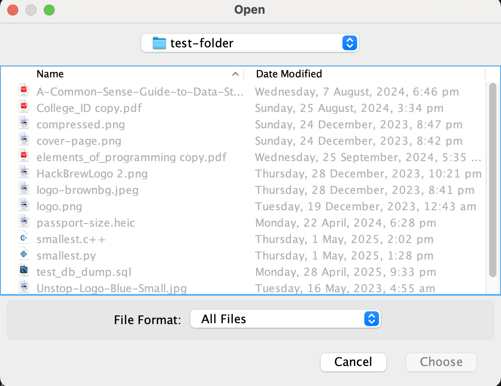

# 📁 Smart File Organizer

A simple yet powerful Java Swing application that automatically organizes your files into categorized folders based on their file types. Perfect for keeping your download folders or project directories clean and manageable.

---

## ✨ Features

- 📂 Select any folder on your system.
- 📦 Automatically organizes files into categories:
  - Documents (PDFs, Word, Excel, etc.)
  - Images
  - Videos
  - Music
  - Executables
  - Web Files
  - Archives
  - Binary Files
  - Others
- 📊 Progress bar to track file organization.
- 📝 Real-time activity log of actions performed.
- 🎨 Clean and user-friendly GUI (with emoji support if available).

---

## 📷 Preview

> GUI loads with:
> - A title bar
> - Select folder button with emoji
> - Progress bar
> - Scrollable log area




---

## 🚀 Getting Started

### Prerequisites

- Java JDK 8 or newer

### How to Run

1. **Clone or Download the Repository**

    ```bash
    git clone https://github.com/username/SmartFileOrganizer.git
    cd SmartFileOrganizer
    ```

2. **Compile the Program**

    ```bash
    javac SmartFileOrganizer.java
    ```

3. **Run the Program**

    ```bash
    java SmartFileOrganizer
    ```

---

## 📁 File Organization Logic

Files are sorted into subfolders inside the selected directory based on extensions:

| Category             | Extensions                                  |
|----------------------|----------------------------------------------|
| Documents/PDFs       | pdf                                          |
| Documents/WordFiles  | doc, docx                                    |
| Documents/ExcelSheets| xls, xlsx                                    |
| Documents/OtherDocs  | txt, rtf                                     |
| Images               | jpg, jpeg, png, gif                          |
| Videos               | mp4, mov, avi, mkv                           |
| Music                | mp3, wav, aac                                |
| Executables          | exe, msi, bat, sh                            |
| WebFiles             | html, css, js                                |
| Archives             | zip, rar, tar, gz                            |
| BinFiles             | bin, dat                                     |
| Others               | Any other file types                         |

---

## 🧑‍💻 Developer Info

- **Language**: Java (Swing)
- **Paradigm**: Object-Oriented, Event-Driven
- **Threading**: Uses `SwingWorker` to keep UI responsive

---

## 🛠️ Future Improvements

- Drag and drop folder selection
- Custom categories support
- Undo functionality
- Dark mode theme

---